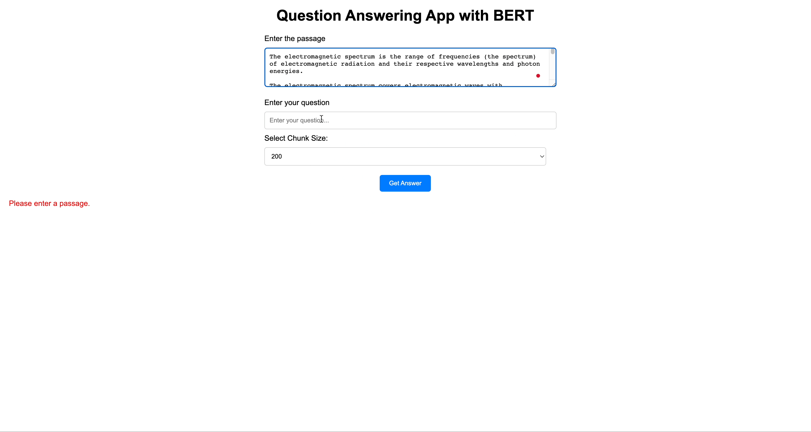

# Question Answering App with BERT and Flask

Welcome to the Question Answering App with BERT and Flask project! This project demonstrates a user-friendly web application that uses a pre-trained BERT-based model to answer questions based on a given passage. The app is built using Python, the transformers library for BERT, Flask for the web framework, and HTML/CSS for the interactive user interface.




## Overview

Have you ever wanted to quickly find answers to specific questions within a large body of text? This app is designed to address that need. Simply input a passage of text and a question, and the app will provide you with a concise answer, highlighting the relevant sections of the passage.

[GitHub](https://github.com/JacobJ215/BERT-QUESTION-ANSWERING-APP)

## BERT: Background and Model

BERT (Bidirectional Encoder Representations from Transformers) is a revolutionary language model developed by Google. Unlike traditional language models that read text in one direction, BERT considers the context of words from both the left and right directions simultaneously. This bidirectional understanding allows BERT to capture deeper contextual relationships between words, resulting in more accurate language understanding and generation.

The BERT model is pre-trained on a massive amount of text data, learning to predict missing words within sentences. This pre-training enables BERT to develop a rich understanding of language nuances and semantics. It has shown remarkable performance across various natural language processing tasks, such as text classification, named entity recognition, and, importantly, question answering.

For this project, we're using a specific variant of the BERT model known as "bert-large-uncased-whole-word-masking-finetuned-squad." This variant has been fine-tuned on the Stanford Question Answering Dataset (SQuAD), making it well-suited for question answering tasks. It's capable of processing both the passage and the question to provide accurate answers.

## Features

- **User-Friendly Interface:** The app provides a simple and intuitive interface for users to input a passage and a question.
- **Chunking for Large Text:** The app automatically chunks large passages into smaller parts for efficient processing.
- **BERT for Accurate Answers:** The app leverages the "bert-large-uncased-whole-word-masking-finetuned-squad" model for accurate answers.
- **Highlighting of Answer Locations:** The app not only provides the answer but also highlights the chunks of the passage that contain the answer.
- **Robustness:** The app checks for the presence of both the passage and the question before attempting to find an answer, providing user-friendly feedback.

## How to Use

1. **Clone the Repository:** Clone this GitHub repository to your local machine.

2. **Set Up the Environment:** Create a virtual environment (optional but recommended) and install the required packages listed in the `requirements.txt` file:
   
   ```
   pip install -r requirements.txt
   ```

3. Run the App: xecute the following command to run the Flask app:xecute the following command to run the Flask app:

    ```bash
    python app.py
    ```


4. Access the App: Open a web browser and navigate to http://127.0.0.1:5000/ to access the app.

5. Input Passage and Question: Once the app is running, you can enter a passage of text and a question in the provided input fields.

6. Get the Answer: Click the "Get Answer" button to receive an answer to your question based on the given passage. The app will also highlight the chunks of the passage that contain the answer.
